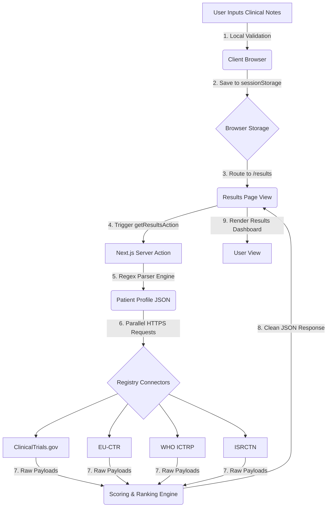
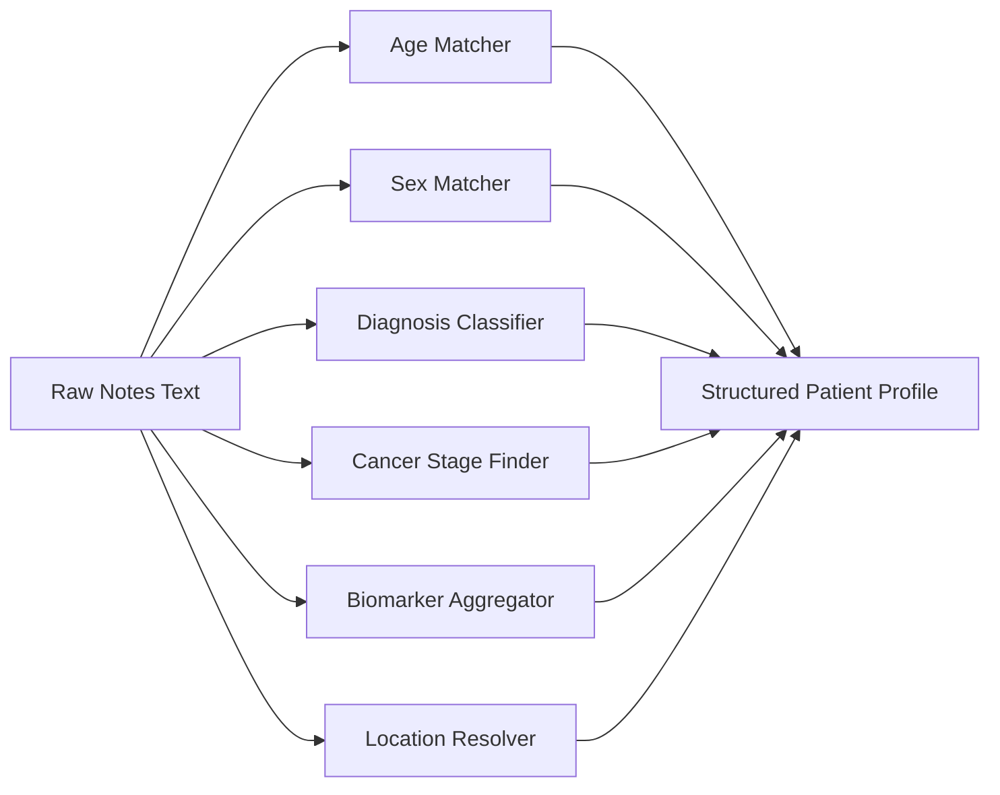

# Clinical Trial Matcher

A privacy-focused, serverless-ready Next.js application that helps patients and care teams identify matching clinical trials. The application parses clinical notes, extracts key patient metrics, queries major trial registries concurrently, and ranks the matches.

---

## 1. System Architecture and Data Flow

The application is built on a stateless model designed for modern serverless hosting. Below is the step-by-step lifecycle of a search request:



---

## 2. Dynamic Clinical Matching Pipeline

Unlike heavy AI tools that run slow and opaque LLM calls, this application relies on a deterministic, rule-based extraction engine that runs in milliseconds.



### Extraction Logic details
* **Age:** Matches patterns like `58-year-old`, `yr`, `y.o.` and bounds results to maximum 120.
* **Biomarkers:** Identifies gene mutations and expression levels (e.g. `HER2`, `EGFR`, `ALK`, `BRCA1/2`, `PD-L1`) case-insensitively.
* **Locations:** Extracts cities, states, and countries, cross-referencing state abbreviations (e.g. `MA`, `CA`) to map regions.

---

## 3. Mathematical Scoring Formula

The matching engine ranks trials using a multi-factor scoring algorithm out of 100 points, detailed below:

$$\text{Final Score} = \text{Baseline} + \text{Diagnosis Match} + \text{Biomarker Match} + \text{Prior Treatments} + \text{Stage Match} + \text{Phase Bonus} + \text{Location Match} + \text{Sex Match}$$

### Score Breakdown
* **Baseline Score (40 Points):** Provided as a start to any trial matching the base condition.
* **Diagnosis Match (Up to 25 Points):** Calculates word overlap between the patient's primary diagnosis and the trial's official title/summary.
* **Biomarkers Match (Up to 8 Points per marker):** Adds points for every matched biomarker (e.g. HER2 positive), capped at a maximum of 85 points prior to subsequent bonuses.
* **Prior Treatments (3 Points per match):** Looks for overlap with eligibility criteria keywords (e.g. chemotherapy history).
* **Stage Match (7 Points):** Matches cancer staging details (e.g. Stage III).
* **Phase Bonus (Up to 12 Points):**
  * Phase IV: +12 points
  * Phase III: +10 points
  * Phase II: +8 points
* **Location Match (10 Points):** Adds points if the trial lists sites in the patient's city, state, or country.
* **Sex Match (Up to 7 Points):** Confirms gender eligibility matches.

---

## 4. Security Architecture Matrix (STRIDE)

This application implements a complete defense-in-depth model, specifically mapped against the STRIDE threat framework:

| Threat Category | Potential Attack Vector | Applied Mitigation | Verify Method |
| :--- | :--- | :--- | :--- |
| **Spoofing** | Session hijacking of user matching summaries | Stateless `sessionStorage` avoids server sessions. Cookies are not used for patient results. | Inspect browser cookies; only ephemeral local storage is populated. |
| **Tampering** | Parameter injection into registry API query strings | Parameter sanitization rejects non-alphanumeric characters, keeping only safe alphanumeric characters, hyphens, and slashes. | Run test notes containing special SQL/command symbols. |
| **Repudiation** | Re-tracking medical history requests | No database is utilized. Note processing is completed strictly in-memory and immediately cleaned. | Code review of the Server Action pipeline. |
| **Information Disclosure** | Internal registry API tracebacks revealing backend servers | Fail-safe try/catch blocks log the error details on the server console and send a generic sanitized error to the client. | Intercept network responses during registry failures. |
| **Denial of Service** | Resource depletion via ReDoS attacks from large texts | notes length validated to be under 10,000 characters before parsing. | Test inputs exceeding 10,000 characters. |
| **Elevation of Privilege** | Server Action memory manipulation or command execution | Next.js server actions process data strictly in-memory without invoking dynamic shell executions. | Code review of data parsing utilities. |

---

## 5. Local Development and Testing

### Prerequisites
* Node.js (v18.0.0 or higher)
* npm

### Local Run Commands
1. Clone the repository:
   ```bash
   git clone https://github.com/Konseptt/clinical-trial-matcher.git
   cd clinical-trial-matcher
   ```
2. Install dependencies:
   ```bash
   npm install
   ```
3. Run in dev mode:
   ```bash
   npm run dev
   ```

### Local Manual QA Checklist
You can test the extraction engine using these test cases:
* **Case 1 (HER2 Breast Cancer):** Paste `"58-year-old female with stage III HER2-positive breast cancer. Lives in Boston, MA. Prior trastuzumab."` -> Verify extraction shows Age: 58, Sex: Female, Location: Boston, MA, Biomarkers: HER2-positive, Stage: III.
* **Case 2 (EGFR Lung Cancer):** Paste `"45 y.o. male with EGFR mutation NSCLC. Location Toronto, Canada."` -> Verify extraction shows Age: 45, Sex: Male, Location: Toronto, Canada, Biomarkers: EGFR.

---

## 6. Serverless Optimization on Vercel

### Ephemeral Architecture
Standard Next.js setups often use in-memory Maps or local Redis stores. On Vercel, serverless functions are ephemeral (stateless and short-lived). If instance A handles notes processing and instance B handles results rendering, in-memory state is lost.

This app solves the serverless state constraint by storing the user's notes in `sessionStorage` inside the browser. When the `/results` page loads:
1. The client reads the notes from its local `sessionStorage`.
2. The client triggers the server action asynchronously.
3. The server action fetches and ranks data dynamically, returning the results directly to the client without writing any local files or holding server-side state.
