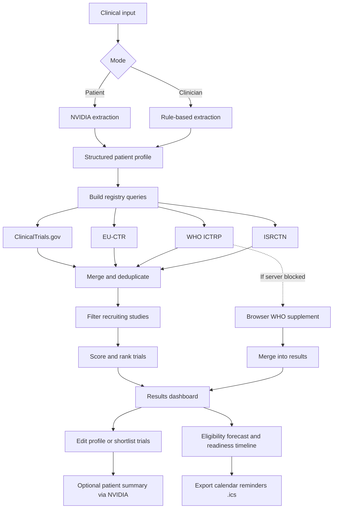

# Clinical Trial Matcher

Search international clinical trial registries using patient clinical information. Supports patient narrative input and clinician chart notes, with ranked results from multiple public databases.

Unlike other matchers that only tell you what fits *today*, this one also forecasts **when** you could become eligible (see [Eligibility Forecast](#eligibility-forecast-the-unique-part)).

**Live:** https://clinicaltrial.ranjansharma.info.np/

## Features

- **Eligibility Forecast (unique):** A forward-looking readiness timeline. Each trial is labelled `Ready now`, `Eligible ~<date>`, `Action needed`, `Opens later`, or `Likely ineligible`, with the specific blockers and next steps. Projected eligibility dates can be exported as calendar reminders (`.ics`).
- **Patient mode:** Narrative clinical summary with structured extraction (requires NVIDIA API key)
- **Clinician mode:** Rule-based extraction from chart notes
- **Registries:** ClinicalTrials.gov, EU-CTR, WHO ICTRP, ISRCTN
- **Scoring:** Diagnosis, biomarker, stage, location, and treatment-history weighting
- **Sort & filter:** Order results by best match, readiness, phase, or proximity; filter by readiness status
- **Shortlist:** Save trials and track recruitment status locally
- **Consultation guide:** Printable summary for oncology visits

## Eligibility Forecast (the unique part)

Most trial matchers answer "which trials match me today?". This app also answers the question patients actually care about: **"When do I become eligible, and what is blocking me right now?"**

Many trials require a *washout period* (a gap after a prior therapy) before enrollment. The matcher reads those requirements from the registry eligibility text, combines them with the patient's own treatment timeline, and:

1. Classifies each trial's readiness (`Ready now`, `Eligible ~<date>`, `Action needed`, `Opens later`, `Likely ineligible`).
2. Projects the earliest date time-based criteria are expected to clear.
3. Lists concrete blockers (e.g. "Trastuzumab washout (90 days) not yet met") and next steps (e.g. "Add an end date for radiation to confirm the 28-day washout").
4. Exports projected eligibility dates as an `.ics` calendar file (with a 7-day advance reminder) so a re-check is never missed.

It is derived entirely from signals already computed during scoring, runs fully client-side, and adds no new data sources. It organizes registry-stated requirements into a personal readiness view; it is **not** medical advice and does not assess true eligibility.

## Requirements

- Node.js 18+ (recommended). Newer LTS releases are supported.
- npm (or a compatible package manager such as `pnpm` or `yarn`)

## Setup

```bash
git clone https://github.com/Konseptt/clinical-trial-matcher.git
cd clinical-trial-matcher
npm install
npm run dev
```

Open http://localhost:3000

### Environment variables

Copy `.env.example` to `.env.local`:

```bash
cp .env.example .env.local
```

| Variable | Required | Purpose |
|----------|----------|---------|
| `NVIDIA_API_KEY` | Patient mode only | Structured extraction from narrative summaries |
| `NVIDIA_MODEL` | No | Model override (default: `meta/llama-3.1-8b-instruct`) |

The API key is server-side only. Clinician mode works without it.

When configured, trial cards also support **Generate patient summary** for consultation materials.
 
Note: example variables are in `.env.example`. Keys are used server-side only; do not commit secrets.

## Sample cases

| URL | Mode |
|-----|------|
| `/?sample=patient` | Patient narrative |
| `/?sample=1` | Clinician notes |

Or use **Load sample case** on the home page.

## How matching works



1. Clinical input is parsed into a structured patient profile
2. Registry-specific queries are built from diagnosis, biomarkers, and location
3. Results are merged, filtered (recruiting / not yet recruiting, phase II+ preferred), and scored
4. Trials are ranked and linked to source registry records

WHO ICTRP may supplement results via a browser-side query when the server endpoint is unavailable.

## Project structure

```
app/
  actions/match.ts    Server actions (search, WHO merge, summaries)
  page.tsx            Home
  results/            Results page
components/           UI
lib/
  extract.ts               Rule-based profile extraction
  extract-ai.ts            Patient-mode NVIDIA extraction
  match.ts                 Search pipeline
  scoring.ts               Match scoring
  eligibility-forecast.ts  Readiness classification + eligibility-date projection
  ics.ts                   Calendar reminder (.ics) export
  registries/              Registry connectors
  simplify-trial.ts        Patient-facing trial summaries
```

## Local storage

The browser stores saved profiles, search history, shortlisted trials, and match timestamps in `localStorage` / `sessionStorage`. No server-side persistence.

## Testing & linting

Run unit tests with Vitest:

```bash
npm run test
```

Run the linter:

```bash
npm run lint
```

Tests are under the `tests/` directory and cover extraction, registry connectors, scoring logic, the eligibility forecast, and calendar export.

## Scripts

```bash
npm run dev      # Development server
npm run build    # Production build
npm run start    # Production server
npm run lint     # ESLint
```

Other useful scripts:

```bash
npm run test     # Run unit tests (Vitest)
```

## Disclaimer

For informational purposes only. This tool does not provide medical advice, diagnosis, or treatment recommendations, and cannot enroll patients in studies. Match scores and eligibility forecasts are algorithmic estimates; confirm eligibility with the oncology care team before pursuing any trial.

## Contributing

Contributions welcome. Open an issue or submit a pull request. Please run `npm run lint` and `npm run test` before creating a PR.

## Deployment

This project is compatible with Vercel and other Next.js hosts. The live site is listed at the top of this file.

## License

MIT
