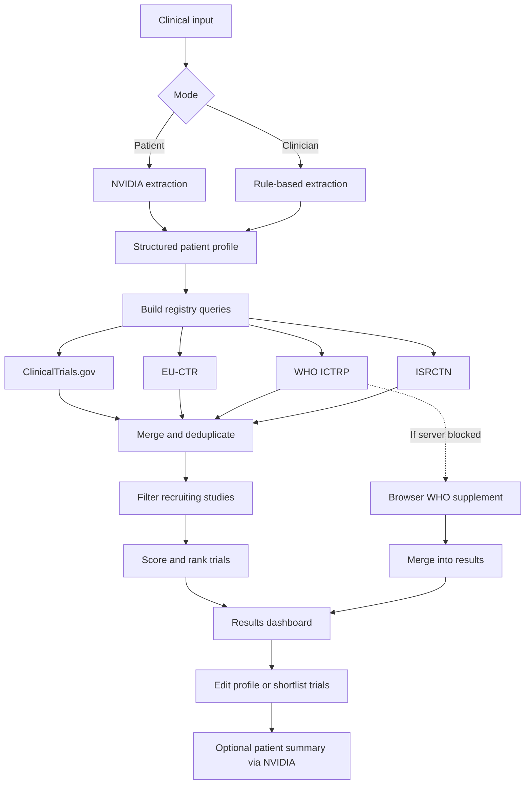

# Clinical Trial Matcher

Search international clinical trial registries using patient clinical information. Supports patient narrative input and clinician chart notes, with ranked results from multiple public databases.

**Live:** https://clinicaltrial.ranjansharma.info.np/

## Features

- **Patient mode:** Narrative clinical summary with structured extraction (requires NVIDIA API key)
- **Clinician mode:** Rule-based extraction from chart notes
- **Registries:** ClinicalTrials.gov, EU-CTR, WHO ICTRP, ISRCTN
- **Scoring:** Diagnosis, biomarker, stage, location, and treatment-history weighting
- **Shortlist:** Save trials and track recruitment status locally
- **Consultation guide:** Printable summary for oncology visits

## Requirements

- Node.js 18+ (recommended). Newer LTS releases are supported.
- npm (or a compatible package manager such as `pnpm` or `yarn`)

## Setup

```bash
git clone https://github.com/Konseptt/clinical-trial-matcher.git
cd clinical-trial-matcher
npm install
npm run dev
```

Open http://localhost:3000

### Environment variables

Copy `.env.example` to `.env.local`:

```bash
cp .env.example .env.local
```

| Variable | Required | Purpose |
|----------|----------|---------|
| `NVIDIA_API_KEY` | Patient mode only | Structured extraction from narrative summaries |
| `NVIDIA_MODEL` | No | Model override (default: `meta/llama-3.1-8b-instruct`) |

The API key is server-side only. Clinician mode works without it.

When configured, trial cards also support **Generate patient summary** for consultation materials.
 
Note: example variables are in `.env.example`. Keys are used server-side only; do not commit secrets.

## Sample cases

| URL | Mode |
|-----|------|
| `/?sample=patient` | Patient narrative |
| `/?sample=1` | Clinician notes |

Or use **Load sample case** on the home page.

## How matching works



1. Clinical input is parsed into a structured patient profile
2. Registry-specific queries are built from diagnosis, biomarkers, and location
3. Results are merged, filtered (recruiting / not yet recruiting, phase II+ preferred), and scored
4. Trials are ranked and linked to source registry records

WHO ICTRP may supplement results via a browser-side query when the server endpoint is unavailable.

## Project structure

```
app/
  actions/match.ts    Server actions (search, WHO merge, summaries)
  page.tsx            Home
  results/            Results page
components/           UI
lib/
  extract.ts          Rule-based profile extraction
  extract-ai.ts       Patient-mode NVIDIA extraction
  match.ts            Search pipeline
  scoring.ts          Match scoring
  registries/         Registry connectors
  simplify-trial.ts   Patient-facing trial summaries
```

## Local storage

The browser stores saved profiles, search history, shortlisted trials, and match timestamps in `localStorage` / `sessionStorage`. No server-side persistence.

## Testing & linting

Run unit tests with Vitest:

```bash
npm run test
```

Run the linter:

```bash
npm run lint
```

Tests are under the `tests/` directory and cover extraction, registry connectors, and scoring logic.

## Scripts

```bash
npm run dev      # Development server
npm run build    # Production build
npm run start    # Production server
npm run lint     # ESLint
```

Other useful scripts:

```bash
npm run test     # Run unit tests (Vitest)
```

## Disclaimer

## Contributing

Contributions welcome. Open an issue or submit a pull request. Please run `npm run lint` and `npm run test` before creating a PR.

## Deployment

This project is compatible with Vercel and other Next.js hosts. The live site is listed at the top of this file.

For informational purposes only. Does not provide medical advice, diagnosis, or treatment recommendations, and cannot enroll patients in studies. Confirm eligibility with the oncology care team before pursuing any trial.

## License

MIT
